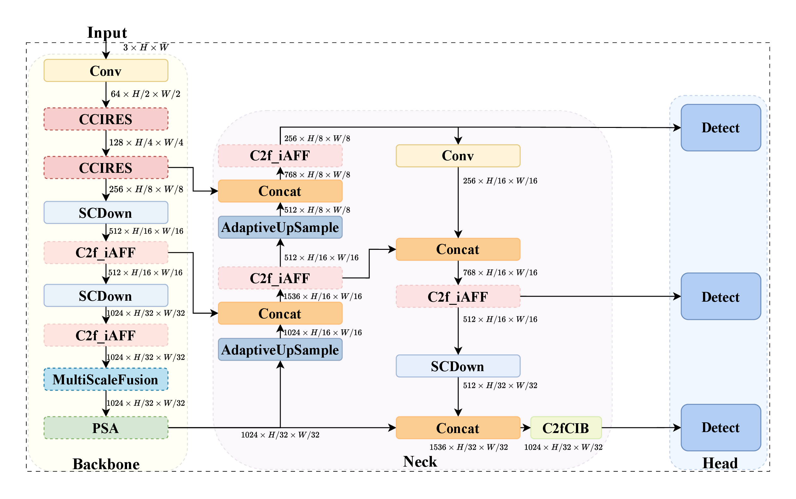
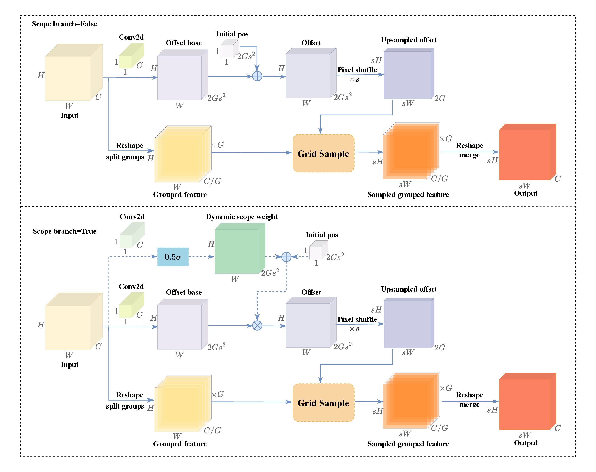
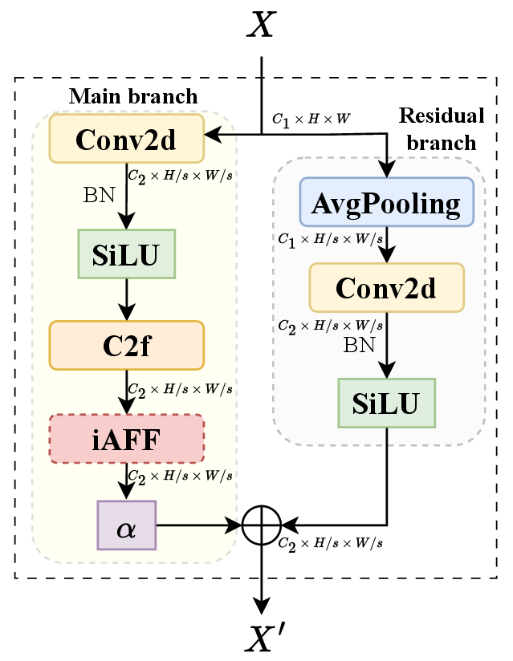
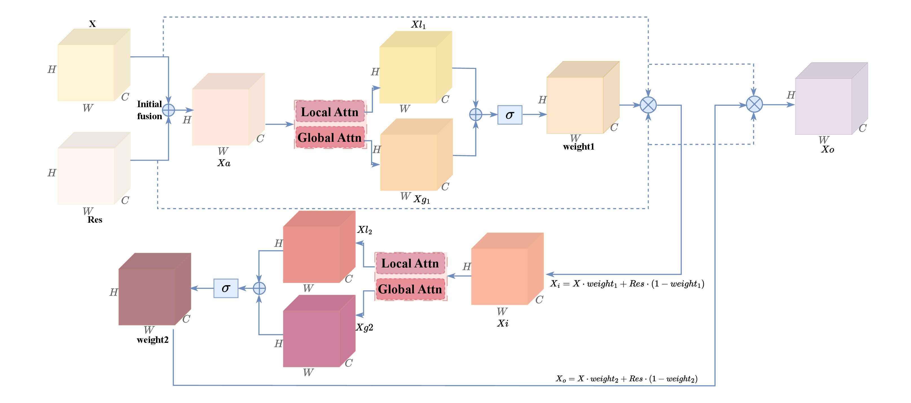
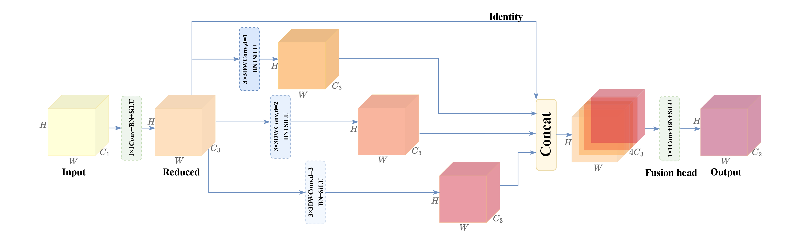
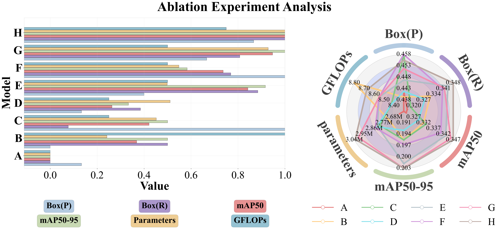
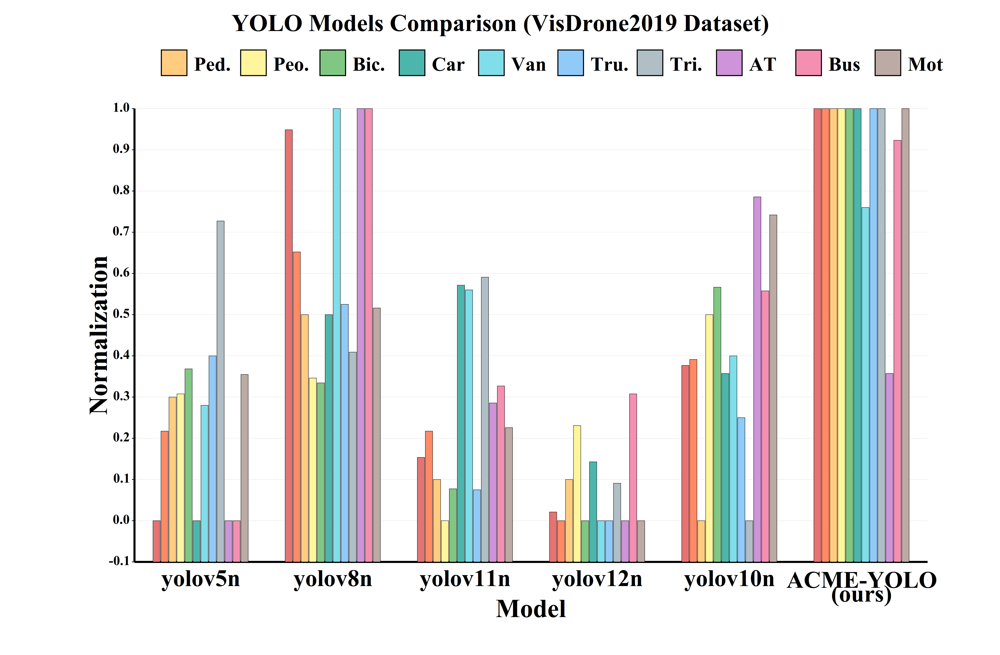
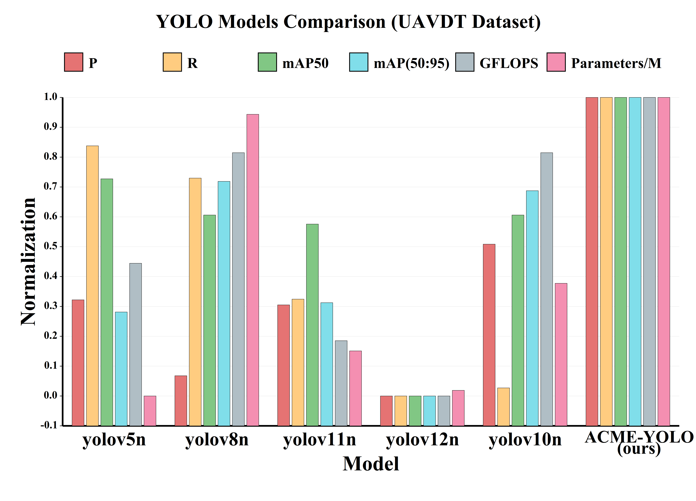
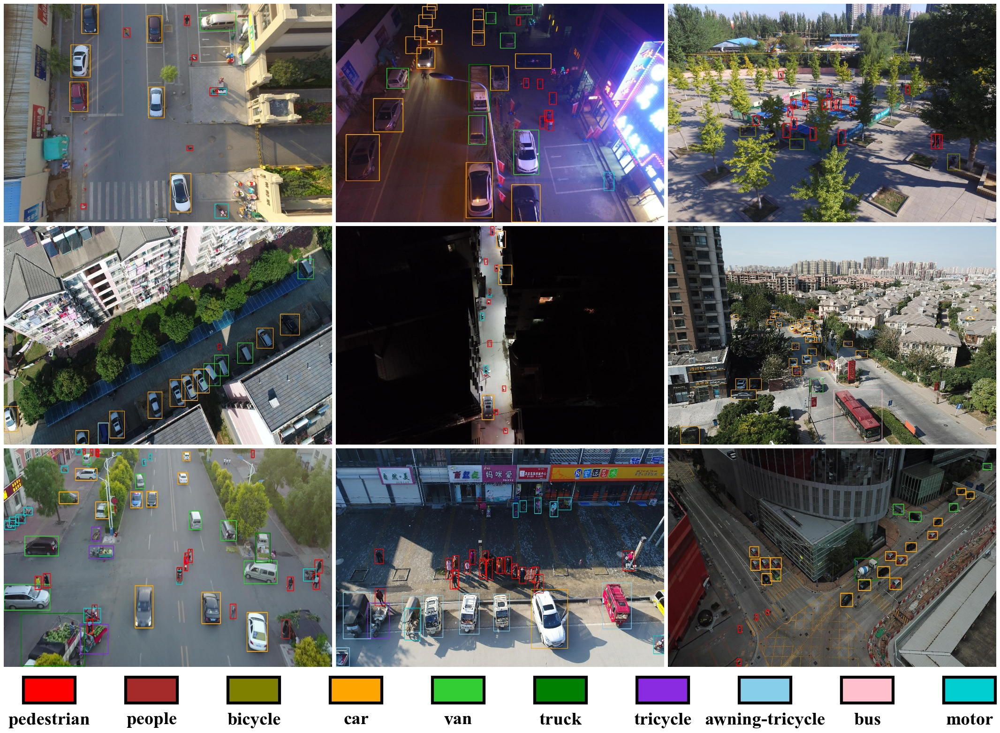

# ACME-YOLO: An Enhanced Small Object Detection Framework in UAVs

<div align="center">

**A Lightweight Object Detection Framework for UAV Aerial Images**

[](https://arxiv.org/) [](LICENSE) [](https://www.python.org/) [](https://pytorch.org/)

</div>

## 📋 Abstract

Dense small object detection in drone aerial images faces multiple challenges such as weak features, large scale variations, complex backgrounds, and easy loss of details. This paper proposes **ACME-YOLO** (Adaptive Upsampling, Channel-Context Residual, and Multi-scale Enhancement YOLO), which systematically optimizes critical bottlenecks in the detection pipeline.

**Three core modules:**
- **CCIRES**: Channel-Context Residual Enhancement Module
- **MultiScaleFusion**: Multi-Scale Fusion Module  
- **AdaptiveUpSample**: Adaptive UpSample Module

On the VisDrone2019 validation set, ACME-YOLO improves mAP50 by **5.8%** compared to YOLOv10n, and by **1.5%** on the UAVDT dataset, effectively enhancing object detection performance in drone scenarios while maintaining real-time capability.

## 🎯 Key Features

- ✅ **Lightweight**: 3.03M parameters (only 11.9% increase)
- ✅ **High Performance**: 34.7% mAP50 on VisDrone2019 (vs 32.8% baseline)
- ✅ **Real-time**: Maintains efficient inference speed
- ✅ **Multi-scale Enhancement**: Effective handling of dense small objects

## 🏗️ Architecture

ACME-YOLO makes targeted improvements based on YOLOv10:
1. **Backbone Network**: CCIRES replaces Conv+C2f at P2 and P3 stages; MultiScaleFusion replaces SPPF
2. **Feature Fusion Network**: AdaptiveUpSample replaces fixed upsampling
3. **Global Enhancement**: C2f_iAFF replaces standard C2f throughout the network

The three modules form a complete pipeline: **enhancement→fusion→restoration**.

<div align="center">
  <div style="display: inline-block; text-align: center;">
    
    <p style="margin: 8px 0 0 0;"><em><strong>Overall architecture of ACME-YOLO</strong></em></p>
  </div>
</div>

## 🔧 Core Modules

### 1. Adaptive UpSample Module
Learns dynamic sampling positions to preserve spatial detail information for small targets.

<div align="center">
  <div style="display: inline-block; text-align: center;">
    
    <p style="margin: 8px 0 0 0;"><em><strong>Structure of the Adaptive UpSample module</strong></em></p>
  </div>
</div>

### 2. CCIRES Module
Integrates iAFF attention mechanisms and learnable scaling factors to enhance small object feature representations and suppress background noise.

<div align="center">
  <table style="margin: 0 auto; border-collapse: collapse; width: auto;">
    <tr>
      <td style="padding: 0 15px; text-align: center; vertical-align: top;">
        
        <p style="margin: 8px 0 0 0; text-align: center;">
          <em><strong>Structure of the CCIRES module</strong></em>
        </p>
      </td>
      <td style="padding: 0 15px; text-align: center; vertical-align: top;">
        
        <p style="margin: 8px 0 0 0; text-align: center;">
          <em><strong>Structure of the iAFF module</strong></em>
        </p>
      </td>
    </tr>
  </table>
</div>

### 3. MultiScaleFusion Module
Uses parallel multi-branch structures to avoid feature degradation caused by serial structures.

<div align="center">
  <div style="display: inline-block; text-align: center;">
    
    <p style="margin: 8px 0 0 0;"><em><strong>Structure of the MultiScaleFusion module</strong></em></p>
  </div>
</div>

## 📊 Experimental Results

### Ablation Study

<div align="center">

**Table 1: YOLOv10n Ablation Study.**

| AUpS | CCIRES | MSF | P | R | mAP@50 | mAP@50:95 | Params/M | GFLOPs |
|:---:|:---:|:---:|:---:|:---:|:---:|:---:|:---:|:---:|
| ✗ | ✗ | ✗ | 0.445 | 0.322 | 0.328 | 0.191 | 2.710 | 8.4 |
| ✓ | ✗ | ✗ | 0.443 | 0.335 | 0.335 | 0.197 | 2.788 | 8.8 |
| ✗ | ✓ | ✗ | 0.458 | 0.324 | 0.336 | 0.197 | 2.856 | 8.5 |
| ✗ | ✗ | ✓ | 0.445 | 0.332 | 0.333 | 0.195 | 2.875 | 8.5 |
| ✓ | ✓ | ✗ | 0.449 | 0.345 | 0.344 | 0.202 | 2.871 | 8.6 |
| ✓ | ✗ | ✓ | 0.458 | 0.342 | 0.342 | 0.198 | 2.887 | 8.6 |
| ✗ | ✓ | ✓ | 0.453 | 0.343 | 0.346 | 0.203 | 3.010 | 8.6 |
| **✓** | **✓** | **✓** | **0.456** | **0.348** | **0.347** | **0.203** | **3.033** | **8.7** |

*AUpS: AdaptiveUpSample, MSF: MultiScaleFusion*

</div>

**Key Findings:**
- Full combination achieves **5.8% relative improvement** in mAP@50 (0.328 → 0.347) with only **11.9% parameter increase** (2.710M → 3.033M)
- Minimal computational overhead (8.4 → 8.7 GFLOPs)

<div align="center">
  <div style="display: inline-block; text-align: center;">
    
    <p style="margin: 8px 0 0 0;"><em><strong>Figure 5: Ablation study results visualization</strong></em></p>
  </div>
</div>

### Comparison with State-of-the-Art Methods

#### VisDrone2019 Dataset

<div align="center">

**Table 2: Comparison on VisDrone2019 Dataset.**

| Network | P(M) | mAP50 (%) | Ped. | Peo. | Bic. | Car | Van | Tru. | Tri. | AT | Bus | Mot. |
|:---:|:---:|:---:|:---:|:---:|:---:|:---:|:---:|:---:|:---:|:---:|:---:|:---:|
| YOLOv5n | 2.51 | 32.8 | 35.4 | 27.8 | 8.86 | 75.3 | 37.9 | 28.4 | 21.7 | 11.5 | 44.0 | 37.1 |
| YOLOv8n | 3.01 | 33.8 | 35.8 | 27.9 | 8.75 | 76.0 | 39.7 | 28.9 | 21.0 | 12.9 | 49.2 | 37.6 |
| YOLOv11n | 2.59 | 32.8 | 35.0 | 27.0 | 7.92 | 76.1 | 38.6 | 27.1 | 21.4 | 11.9 | 45.7 | 36.7 |
| YOLOv12n | 2.52 | 32.3 | 35.0 | 27.6 | 7.67 | 75.5 | 37.2 | 26.8 | 20.3 | 11.5 | 45.6 | 36.0 |
| YOLOv10n | 2.71 | 32.8 | 34.8 | 28.3 | 9.50 | 75.8 | 38.2 | 27.8 | 20.1 | 12.6 | 46.9 | 38.3 |
| **ACME-YOLO** | **3.03** | **34.7** | **36.8** | **29.6** | **10.9** | **76.7** | **39.1** | **30.8** | **22.3** | **12.0** | **48.8** | **39.1** |

*Ped.: Pedestrian, Peo.: People, Bic.: Bicycle, Tru.: Truck, Tri.: Tricycle, AT: Awning Tricycle, Mot.: Motor*

</div>

<div align="center">
  <div style="display: inline-block; text-align: center;">
    
    <p style="margin: 8px 0 0 0;"><em><strong>Figure 6: Comparison results on VisDrone2019 dataset</strong></em></p>
  </div>
</div>

#### UAVDT Dataset

<div align="center">

**Table 3: Comparison on UAVDT Dataset.**

| Model | P | R | mAP50 | mAP(50:95) | Params/M | GFLOPs |
|:---:|:---:|:---:|:---:|:---:|:---:|:---:|
| YOLOv5n | 0.838 | 0.781 | 0.849 | 0.526 | 2.51 | 7.2 |
| YOLOv8n | 0.823 | 0.787 | 0.845 | 0.540 | 3.01 | 8.2 |
| YOLOv11n | 0.837 | 0.762 | 0.844 | 0.527 | 2.59 | 6.5 |
| YOLOv12n | 0.819 | 0.750 | 0.825 | 0.517 | 2.52 | 6.0 |
| YOLOv10n | 0.849 | 0.751 | 0.845 | 0.539 | 2.71 | 8.4 |
| **ACME-YOLO** | **0.878** | **0.787** | **0.858** | **0.549** | **3.04** | **8.7** |

</div>

<div align="center">
  <div style="display: inline-block; text-align: center;">
    
    <p style="margin: 8px 0 0 0;"><em><strong>Figure 7: Comparison results on UAVDT dataset</strong></em></p>
  </div>
</div>

### Detection Results

<div align="center">
  <div style="display: inline-block; text-align: center;">
    
    <p style="margin: 8px 0 0 0;"><em><strong>Figure 8: Detection results on various challenging scenarios</strong></em></p>
  </div>
</div>

## 🚀 Getting Started

### Installation

```bash
git clone https://github.com/Nahuyiur/ACME-YOLO.git
cd ACME-YOLO
conda env create -f yolo_environment.yml
conda activate yolo_env
```

### Dataset Preparation

1. **Download VisDrone2019 Dataset:**
   - Visit [VisDrone2019 Dataset](http://aiskyeye.com/)
   - Download and extract the dataset
   - Dataset split: 6,471 train / 548 validation / 3,190 test images

2. **Organize dataset structure:**
   ```
   VisDrone2019/
   ├── images/
   │   ├── train/
   │   ├── val/
   │   └── test/
   └── labels/
       ├── train/
       ├── val/
       └── test/
   ```

3. **Update dataset configuration:**
   - Edit `data/Visdrone2019_dataset.yaml`
   - Update the `train`, `val`, and `test` paths to point to your dataset directories

### Training

```bash
python train.py --model adaptive_upsample_ccires_multiscale \
    --epochs 300 --batch 16 --name acme_yolo_full
```

### Evaluation

```bash
python val.py --weights runs/V10train/exp/weights/best.pt --split val --batch 16
python test.py --weights runs/V10train/exp/weights/best.pt --split test --batch 16
```

## 📈 Performance Summary

- **Parameters**: 3.03M (11.9% increase over baseline 2.710M)
- **GFLOPs**: 8.7
- **mAP@50 on VisDrone2019**: 34.7% (vs 32.8% baseline, **+1.9 pp**)
- **mAP@50 improvement**: **5.8%** relative improvement (0.328 → 0.347)
- **mAP@50 on UAVDT**: 0.858 (vs 0.845 baseline, **+1.5%**)

## 📝 Citation

```bibtex
@article{acme_yolo2024,
  title={ACME-YOLO: An Enhanced Small Object Detection Framework in UAVs},
  author={Your Name},
  journal={arXiv preprint},
  year={2024}
}
```

## 📄 License

This project is licensed under the MIT License - see the [LICENSE](LICENSE) file for details.

## 🙏 Acknowledgments

- [Ultralytics](https://github.com/ultralytics/ultralytics) for YOLOv10 framework
- [VisDrone](http://aiskyeye.com/) and [UAVDT](https://sites.google.com/site/daviddo0323/projects/uavdt) dataset providers
